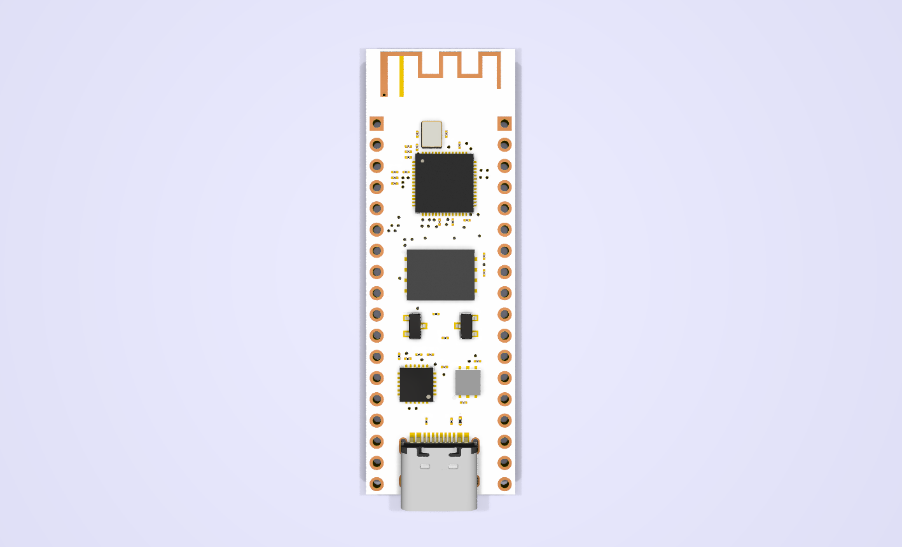
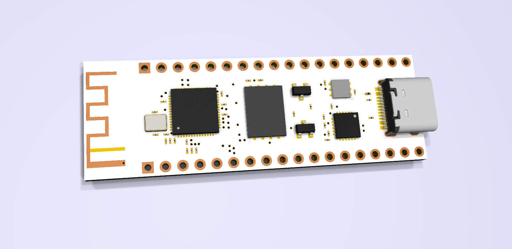
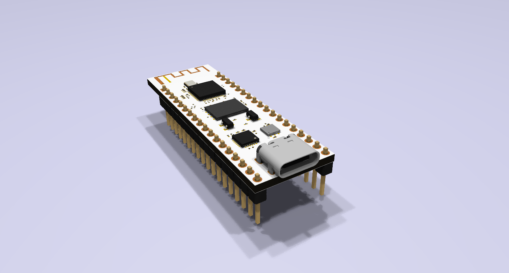

# ESP32-S2-DEV
ESP32-S2 Dev Board 
JLCPCB 2313 4-Layer Controlled Impedence Stackup All Components Available on LCSC.  
Features: 
128Mb FLASH. 
USB-C Connector for Programming All Usable GPIOs exposed. 
PCB etched Inverted F Antenna.

